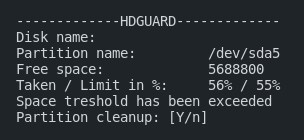
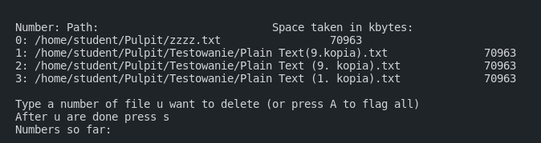

# hdguard

  
<h2 style="display: inline-block">Table of Contents</h2>

  <ol>
    <li><a href="#about-the-project">About The Project</a></li>
    <li><a href="#usage">Usage</a></li>
    <li><a href="#overview">Overview</a></li>
    <li><a href="#algorithm">Algorithm</a></li>
  </ol>

## About The Project
This is a bash script that monitors your disk free space and gives a warning when the set treshold is exceeded. You can either choose to ignore it or delete the files from the list prepared by it until you are below the treshold again.

## Usage
Replace the value with a number of % that you dont want to exceed.

`./hdguard value`

Alternatively

`bash hdguard value`

## Overview
Example preview: 
  
Example list of files: 

## Algorithm
Pretty simple scheme of how this script works:

while : 
do
- -check treshold value
  - if not correct change or ignore
  - -check if the treshold has been exceeded
    - if not: sleep 60
    - if yes: -ask for a cleanup
      - if not: ignore and sleep 60
      - if yes: -find the list of files
        - while :
        - do
        - -show the list to user
          - if yes: check them all
          - if a few: mark them and show nnext one
          - if not: show next one
          - if abort: return
        - -check if the list has ended
          - if yes: -delete selected files
        - -check if abort
          - if yes: return
        - -check if more space needs to be freed
          - if not: break
        - done
- -create file hdguard_date_hour.delete
- -delete selected files

done
